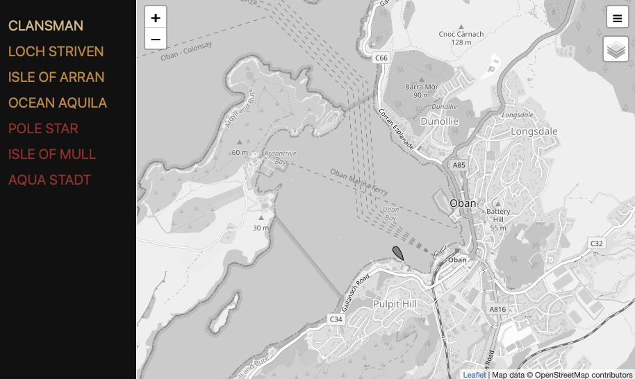

# node-red-contrib-flow-ais1
A Node-Red flow to plot recently-seen vessels on a map

## Introduction
The automatic identification system (AIS) is an automatic tracking system that uses transponders on ships.
This flow accepts information from an AIS receiver, stores it in a database, and
displays a web page showing the names and positions of the most recently-seen vessels.
Here is a sample screenshot.



## Install
These instructions assume you are running node-red on a Raspberry Pi, and are
logged on using the `pi` username. They assume you are using `rtl_ais` and that it
is installed and working, receiving AIS messages and sending them to port 10110
using UDP.

Ensure that the database system `Sqlite3` is installed using

```
sudo apt-get install sqlite3
```

Make sure you are in the home directory `/home/pi`.
Create a suitable empty database called `ships.db` by copying the below
commands and pasting them into your terminal session:

```
sqlite3 ships.db
CREATE TABLE ships (name varchar(80), mmsi varchar(9) unique, type integer, dest);
CREATE TABLE tracks (mmsi varchar(9), lat real, long real, course real optional, speed real optional, time integer);
CREATE TABLE last (lastlat real, lastlong real, lastspeed real, lastcourse real, lasttime integer, mmsi varchar(9) unique);
.quit
```

You now need to install the node-red modules which this flow uses. They are
`node-red-contrib-ais-decoder`, `node-red-contrib-web-worldmap` and
`node-red-node-sqlite`. Then import and deploy the flow.

To see the result, visit http://your.pis.ip.address:1880/main. The left side
of the screen contains a list of recently-seen vessels -initially this will
be empty, but as time goes on your AIS receiver will pick up more vessels and
store them in the database. The list is ordered with the most recently-seen
vessel at the top. The longer it is since a vessel was seen, the darker it
will appear in the list. Click on a name to see the last-known location.
Right-click on the marker to see more information about the vessel.
